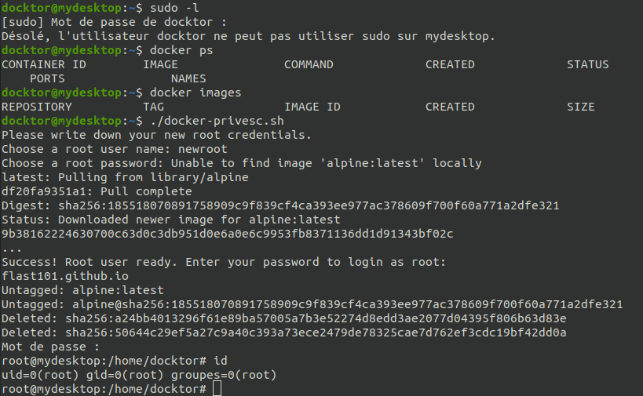
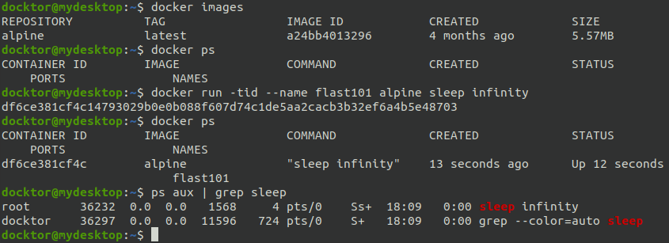
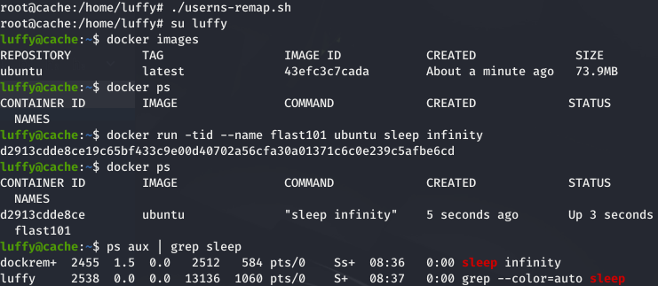

# Abusing Docker Configuration

## Requirements:

- Access to a shell on the target with a user which can run Docker.
- The target should have either an internet connection or an image installed in Docker. Use **`docker images`** to check and change the "alpine" image accordingly. If there is no image go to [https://hub.docker.com](https://hub.docker.com) to get one (tar.gz file with its Dockerfile) and upload it on the target in your working directory.

## Usage example:

* * * 
## Mitigation 

By default, the process is run as root in the container:

Applying the mitigation, we can get rid of this problem. The user "dockremap" is now running the process:

